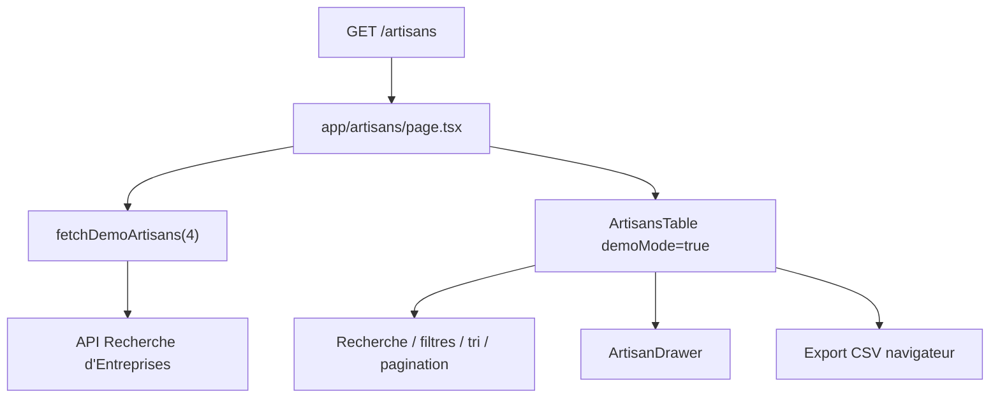
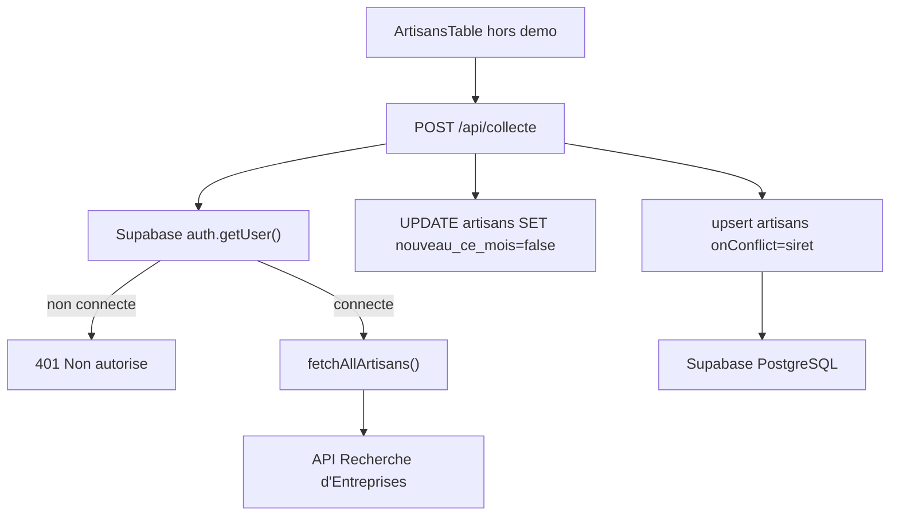
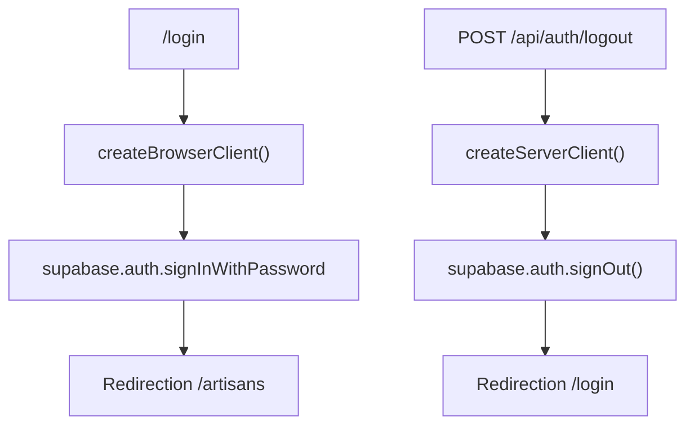
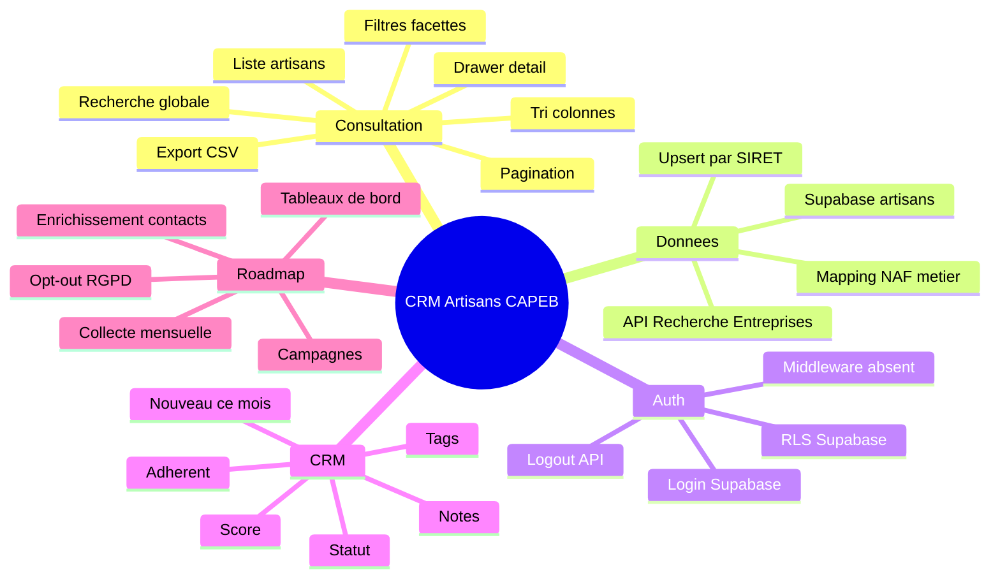

# Analyse du projet CRM-interne-contacts

Date d'analyse : 2026-06-15

## 1. Resume executif

Le projet est un CRM interne pour la CAPEB Adour Pyrenees. Son objectif est de constituer et exploiter un annuaire d'artisans du batiment des departements 64 et 65, en s'appuyant sur l'API officielle Recherche d'Entreprises, puis sur Supabase pour l'authentification et la persistance.

L'etat actuel correspond a un socle Phase 1 partiellement realise :

- application Next.js App Router fonctionnelle ;
- page principale `/artisans` avec grille TanStack Table, filtres, tri, pagination, export CSV et drawer de detail ;
- schema `artisans` defini en SQL Supabase et en Drizzle ;
- login Supabase code, mais routes applicatives non protegees ;
- route API de collecte vers Supabase presente, mais non branchee a l'interface actuelle ;
- affichage principal encore en mode demo, avec donnees chargees directement depuis l'API publique.

Les deux risques majeurs sont :

1. le mapping de l'API Recherche d'Entreprises ne correspond pas a la structure reelle de la reponse ;
2. le flux Supabase n'est pas encore utilise par la page principale.

## 2. Resume fonctionnel du CRM

### Fonctionnalites presentes

- Consultation d'une liste d'artisans du batiment 64/65.
- Recherche globale dans la grille.
- Filtres :
  - departement ;
  - categorie metier ;
  - statut CRM ;
  - RGE.
- Tri par colonne.
- Pagination cote client.
- Export CSV.
- Drawer de consultation d'une fiche artisan :
  - identite ;
  - SIRET/SIREN ;
  - activite et code NAF ;
  - adresse ;
  - contact ;
  - effectif ;
  - chiffre d'affaires ;
  - statut, RGE, adherent, nouveau ce mois.
- Formulaire de connexion Supabase.
- Route de deconnexion Supabase.
- Route API de collecte permettant, en theorie, d'importer les artisans dans Supabase.

### Fonctionnalites prevues mais non finalisees

- Protection effective des routes internes.
- Lecture de la table Supabase `artisans` dans `/artisans`.
- Bouton de deconnexion visible dans l'interface.
- Colonnes masquables dans la grille.
- Filtre dedie par ville.
- Collecte mensuelle automatisee par GitHub Actions.
- Detection fiable des vrais nouveaux SIRET du mois.
- Enrichissement telephone/email/site/reseaux sociaux.
- Tables annexes : interactions, campagnes, opt-out, utilisateurs metier.
- Documentation d'installation et de configuration Supabase.

## 3. Architecture technique

### Stack utilisee

| Couche | Technologie | Etat |
| --- | --- | --- |
| Framework web | Next.js 16.2.7, App Router | Actif |
| Langage | TypeScript 5 | Actif |
| UI | React 19, Tailwind CSS 4, shadcn/ui | Actif |
| Composants primitifs | `@base-ui/react` | Utilise via shadcn/base-ui |
| Table de donnees | TanStack Table v8 | Actif |
| Auth | Supabase Auth | Partiel |
| Base de donnees | Supabase PostgreSQL | Migration presente |
| Acces BDD runtime | Supabase JS | Partiel |
| ORM | Drizzle ORM | Schema/types seulement |
| Collecte externe | API Recherche d'Entreprises | Actif en demo, route prod presente |
| Deploiement cible | Vercel + Supabase | Non documente dans le repo |

Point notable : `CLAUDE.md` mentionne Next.js 15 comme stack imposee, mais le projet installe actuellement Next.js 16.2.7.

### Structure des dossiers

```text
/workspace
+-- app/
|   +-- layout.tsx
|   +-- page.tsx
|   +-- globals.css
|   +-- login/page.tsx
|   +-- artisans/
|   |   +-- page.tsx
|   |   +-- loading.tsx
|   +-- api/
|       +-- collecte/route.ts
|       +-- auth/logout/route.ts
+-- components/
|   +-- artisans-table.tsx
|   +-- artisan-drawer.tsx
|   +-- ui/
+-- lib/
|   +-- collecte/
|   |   +-- categories-naf.ts
|   |   +-- fetch-artisans.ts
|   |   +-- fetch-demo.ts
|   +-- db/schema.ts
|   +-- supabase/client.ts
|   +-- supabase/server.ts
|   +-- utils.ts
+-- supabase/migrations/001_artisans.sql
+-- docs/index.html
+-- CLAUDE.md
+-- AGENTS.md
+-- package.json
+-- next.config.ts
+-- tsconfig.json
+-- postcss.config.mjs
+-- components.json
```

### Fichiers absents importants

- `middleware.ts` : aucune protection centralisee des routes.
- `.env.example` : pas de modele de variables d'environnement.
- `drizzle.config.ts` : Drizzle n'est pas configure pour les migrations.
- `lib/db/index.ts` ou equivalent : pas de client Drizzle/Postgres.
- `.github/workflows/*` : pas d'automatisation mensuelle.
- Documentation projet dediee dans `README.md` : le README est encore celui de `create-next-app`.

## 4. Dependances principales

Extrait fonctionnel des dependances :

- `next`, `react`, `react-dom` : socle applicatif.
- `typescript` : typage.
- `tailwindcss`, `@tailwindcss/postcss`, `tw-animate-css` : styling.
- `shadcn`, `@base-ui/react`, `lucide-react`, `class-variance-authority`, `clsx`, `tailwind-merge` : UI et composants.
- `@tanstack/react-table` : grille de donnees.
- `@supabase/ssr`, `@supabase/supabase-js` : Auth et acces Supabase.
- `drizzle-orm`, `drizzle-kit` : schema/types BDD, migrations potentielles.
- `postgres`, `@neondatabase/serverless` : dependances installees mais non utilisees dans le code actuel.

Scripts npm disponibles :

```json
{
  "dev": "next dev",
  "build": "next build",
  "start": "next start"
}
```

Il n'existe pas encore de scripts `lint`, `typecheck`, `test`, `db:migrate` ou `collecte`.

## 5. Points d'entree de l'application

### Pages

| Route | Fichier | Role |
| --- | --- | --- |
| `/` | `next.config.ts` redirige vers `/artisans` | Entree racine |
| `/artisans` | `app/artisans/page.tsx` | Page principale CRM |
| `/login` | `app/login/page.tsx` | Connexion Supabase |

`app/page.tsx` retourne `null`, car la redirection est geree par `next.config.ts`.

### Routes API

| Endpoint | Methode | Fichier | Role |
| --- | --- | --- | --- |
| `/api/collecte` | `POST` | `app/api/collecte/route.ts` | Collecte API Etat puis upsert Supabase |
| `/api/auth/logout` | `POST` | `app/api/auth/logout/route.ts` | Deconnexion Supabase puis redirection `/login` |

### Composants metier

| Fichier | Role |
| --- | --- |
| `components/artisans-table.tsx` | Grille principale : filtres, tri, pagination, export CSV, appel collecte |
| `components/artisan-drawer.tsx` | Fiche detail d'un artisan |
| `components/ui/*` | Composants UI shadcn/base-ui |

## 6. Flux de donnees

### Flux actif d'affichage



Caracteristiques :

- la page charge au maximum 4 pages de 25 resultats, soit environ 100 lignes ;
- aucune session n'est exigee pour acceder a `/artisans` ;
- aucune lecture Supabase n'est effectuee ;
- le bouton "Lancer la collecte" est masque par `demoMode`.

### Flux de collecte code mais non utilise par l'UI actuelle



Caracteristiques :

- la route verifie l'utilisateur Supabase ;
- la collecte appelle l'API publique avec :
  - `departement=64,65`
  - `section_activite_principale=F`
  - `etat_administratif=A`
  - `per_page=25`
- une pause de 200 ms est appliquee entre les pages ;
- le garde-fou est fixe a 400 pages, soit 10 000 resultats maximum ;
- l'upsert se fait par `siret`.

### Flux d'authentification



L'authentification existe, mais elle n'est pas appliquee comme garde globale. La route `/artisans` reste accessible sans session.

## 7. Base de donnees

### Table principale

La table `artisans` est definie dans :

- `supabase/migrations/001_artisans.sql` pour la migration SQL ;
- `lib/db/schema.ts` pour le schema Drizzle et les types TypeScript.

Champs principaux :

- identite : `nom_entreprise`, `siret`, `siren` ;
- activite : `activite`, `code_naf`, `categorie_metier` ;
- localisation : `adresse`, `code_postal`, `ville`, `departement` ;
- contact : `telephone`, `email`, `site_internet`, `reseaux_sociaux` ;
- donnees administratives : `nombre_salaries`, `chiffre_affaires`, `date_creation`, `rge` ;
- CRM : `statut`, `est_adherent`, `tags`, `notes`, `score`, `date_dernier_contact`, `nouveau_ce_mois`.

### Contraintes et index

- `siret` est unique et non nul.
- RLS activee sur `artisans`.
- Policies :
  - lecture pour `authenticated` ;
  - ecriture pour `authenticated`.
- Index sur :
  - `departement` ;
  - `categorie_metier` ;
  - `statut` ;
  - `rge` ;
  - `nouveau_ce_mois` ;
  - recherche full-text sur `nom_entreprise` + `ville`.

### Divergences identifiees

| Sujet | SQL | Drizzle | Risque |
| --- | --- | --- | --- |
| Type `id` | `UUID DEFAULT gen_random_uuid()` | `text().default('gen_random_uuid()')` | Types incoherents, generation incorrecte si Drizzle est utilise pour inserer |
| Migrations | SQL manuel | Pas de `drizzle.config.ts` | Deux sources de verite |
| Acces BDD | Supabase JS | Drizzle non utilise | Dependances et schema Drizzle partiellement decorreles |

## 8. API externes

### API Recherche d'Entreprises

Service utilise :

```text
https://recherche-entreprises.api.gouv.fr/search
```

Usage actuel :

- affichage demo via `lib/collecte/fetch-demo.ts` ;
- collecte complete via `lib/collecte/fetch-artisans.ts`.

Constat important : la structure reelle de la reponse ne correspond pas aux interfaces TypeScript actuelles. Les champs d'etablissement ne sont pas au premier niveau de `results[]`, mais notamment dans :

- `siege.siret`
- `siege.adresse`
- `siege.code_postal`
- `siege.libelle_commune`
- `siege.departement`
- `matching_etablissements[]`
- `complements.est_rge`
- `finances` sous forme d'objet par annee.

Le code actuel lit plutot :

- `e.siret`
- `e.adresse`
- `e.code_postal`
- `e.libelle_commune`
- `e.departement`
- `e.est_rge`
- `e.finances?.[0]?.chiffre_affaires`

Impact probable : SIRET, adresse, ville, departement, RGE et chiffre d'affaires peuvent etre vides ou faux.

### Integrations non implementees

- Google Places API : prevue en Phase 2.
- Scraping site web : prevu en Phase 2.
- Pappers : optionnel, non implemente.
- Brevo/Resend : prevu en Phase 3.
- Supabase Storage : prevu pour les plaquettes, non utilise actuellement.

## 9. Systeme d'authentification et securite

### Etat actuel

- `lib/supabase/client.ts` cree un client navigateur.
- `lib/supabase/server.ts` cree un client serveur avec cookies Next.
- `/login` utilise `signInWithPassword`.
- `/api/auth/logout` utilise `signOut`.
- `/api/collecte` verifie `supabase.auth.getUser()`.

### Lacunes

- Pas de middleware de protection.
- `/artisans` public.
- La redirection `/` vers `/artisans` contourne la page login.
- Pas de bouton deconnexion dans l'interface.
- Pas de separation claire entre mode demo public et mode CRM interne authentifie.
- Les variables d'environnement Supabase sont forcees avec `!`; une configuration manquante provoquera une erreur runtime peu explicite.

## 10. Schema des principales fonctionnalites



## 11. Dettes techniques identifiees

1. **Deux sources de donnees concurrentes** : la page lit l'API publique, la route API ecrit dans Supabase, mais aucun flux de lecture Supabase n'est branche.
2. **Mapping API fragile et probablement incorrect** : interfaces TypeScript non alignees avec la reponse reelle.
3. **Auth incomplete** : login existe, mais pas de garde route.
4. **Drizzle partiellement integre** : schema present, mais pas de client, pas de config, pas de scripts.
5. **Dependencies inutilisees** : `postgres`, `@neondatabase/serverless` semblent non utilisees.
6. **README generique** : pas de documentation metier, setup Supabase, migration ou variables d'environnement.
7. **Pas de `.env.example`** : friction importante pour installer le projet.
8. **Pas de scripts de qualite** : absence de lint/typecheck/test.
9. **Pas d'automatisation cron** : la collecte mensuelle prevue n'existe pas.
10. **Logique CRM non preservee a l'upsert** : risque d'ecraser `statut`, `notes`, `tags`, `est_adherent`, etc.
11. **Collecte longue dans une route API** : risque de timeout en environnement serverless.
12. **Pas de batch upsert** : risque de payload volumineux et d'echec global.
13. **RLS ecriture peu explicite** : policy `FOR ALL` sans `WITH CHECK` dedie.
14. **Prototype statique conserve dans `docs/index.html`** : utile comme reference, mais peut devenir source de confusion.

## 12. Bugs potentiels

### Critiques

1. **SIRET absent lors du mapping**
   - Le code lit `e.siret`.
   - La reponse reelle expose plutot `siege.siret` ou `matching_etablissements[].siret`.
   - Impact : upsert impossible ou donnees non exploitables, car `siret` est unique et obligatoire.

2. **Mauvais modele entreprise/etablissement**
   - La recherche par departement renvoie des entreprises avec etablissements correspondants.
   - Utiliser uniquement l'entreprise ou le siege peut associer un mauvais departement ou une mauvaise adresse.
   - Impact : artisans hors zone ou etablissements 64/65 manquants.

3. **Tous les artisans recoltes marques nouveaux**
   - `mapEntrepriseToArtisan` force `nouveau_ce_mois: true`.
   - La route reset tout a `false`, puis upsert tout a `true`.
   - Impact : la vue "Nouveautes du mois" serait fausse.

4. **Ecrasement des champs CRM**
   - L'upsert envoie des valeurs par defaut comme `statut: 'nouveau'`.
   - Impact : perte de qualification commerciale au prochain import.

### Eleves

5. **Acces non authentifie a `/artisans`**
   - La page principale est accessible sans login.
   - Impact : exposition de donnees internes lorsque la page sera branchee a Supabase.

6. **RGE probablement faux**
   - Le code lit `e.est_rge`.
   - La reponse expose `complements.est_rge` et parfois des listes RGE d'etablissement.

7. **Chiffre d'affaires probablement jamais lu**
   - Le code attend un tableau `finances`.
   - La reponse reelle est un objet indexe par annee.

8. **Timeout possible de `/api/collecte`**
   - Jusqu'a 400 pages avec attente de 200 ms.
   - Sans compter le temps reseau et l'upsert final, la route peut depasser les limites serverless.

### Moyens

9. **Incoherence `id` Drizzle/SQL**
   - Le type et la valeur par defaut ne correspondent pas.

10. **Erreur runtime si variables Supabase absentes**
    - `process.env.NEXT_PUBLIC_SUPABASE_URL!` et `NEXT_PUBLIC_SUPABASE_ANON_KEY!` sont obligatoires mais non documentees.

11. **Pagination vide : affichage "Page 1 / 0" possible**
    - Si aucune donnee, `table.getPageCount()` peut valoir 0.

12. **CSV limite aux donnees chargees cote client**
    - En mode demo, export de 100 lignes environ, pas de la base complete.

## 13. Ameliorations possibles

### Produit / metier

- Ajouter une vraie vue "Nouveautes du mois".
- Ajouter une fiche artisan editable pour statut, notes, tags, score, adherent.
- Ajouter un filtre ville dedie.
- Ajouter une vue "A contacter" et "Relances".
- Ajouter l'historique des interactions.
- Ajouter l'opt-out avant toute fonctionnalite de campagne.

### Technique

- Rebrancher `/artisans` sur Supabase.
- Ajouter middleware auth.
- Corriger le mapping API.
- Decouper collecte et upsert en batchs.
- Ajouter une GitHub Action de collecte mensuelle.
- Clarifier Drizzle vs Supabase JS comme couche d'acces principale.
- Ajouter scripts `lint`, `typecheck`, et eventuellement tests unitaires du mapping.
- Ajouter `.env.example` et README metier.

### Securite / RGPD

- Proteger toutes les routes CRM.
- Documenter la politique de conservation.
- Prevoir table `liste_opt_out`.
- Eviter tout affichage public de donnees personnelles d'entreprises individuelles.
- Journaliser les imports et enrichissements.

## 14. Top 10 des ameliorations impact / effort

| Priorite | Amelioration | Impact | Effort relatif | Pourquoi |
| --- | --- | --- | --- | --- |
| 1 | Corriger le mapping API Recherche d'Entreprises | Tres fort | Moyen | Sans cela, les donnees cles peuvent etre fausses ou vides. |
| 2 | Preserver les champs CRM lors des upserts | Tres fort | Moyen | Evite la perte de qualification commerciale. |
| 3 | Calculer correctement `nouveau_ce_mois` | Fort | Moyen | Fonctionnalite centrale pour la collecte mensuelle. |
| 4 | Proteger `/artisans` avec un middleware Supabase | Tres fort | Faible a moyen | Rend l'outil conforme a son usage interne. |
| 5 | Brancher `/artisans` sur Supabase | Tres fort | Moyen | Transforme la demo en CRM exploitable. |
| 6 | Ajouter `.env.example` et README d'installation | Fort | Faible | Reduit fortement la friction de reprise/deploiement. |
| 7 | Ajouter un script `typecheck` et verifier le build en CI locale | Moyen a fort | Faible | Detecte vite les regressions TypeScript/Next. |
| 8 | Decouper la collecte en batchs | Fort | Moyen | Reduit les risques de timeout et d'echec global. |
| 9 | Clarifier Drizzle : l'activer completement ou le retirer | Moyen | Faible a moyen | Diminue la complexite et les divergences schema. |
| 10 | Ajouter l'UI de colonnes masquables deja preparee dans TanStack | Moyen | Faible | Termine une exigence Phase 1 avec peu d'impact technique. |

## 15. Recommandations de trajectoire

### Court terme technique

1. Ecrire un mapper robuste de l'API officielle avec tests unitaires sur un fixture de reponse reelle.
2. Decider si la source principale est l'etablissement (`matching_etablissements`) ou le siege, puis documenter ce choix.
3. Lire Supabase dans `/artisans` apres verification de session.
4. Ajouter `middleware.ts` pour proteger les routes internes.
5. Modifier l'upsert pour separer les champs importes des champs CRM.

### Court terme documentation

1. Remplacer le README generique par une documentation projet.
2. Ajouter `.env.example`.
3. Documenter l'execution de la migration Supabase.
4. Documenter les limites de l'API publique et le choix SIRET/etablissement.

### Moyen terme

1. Migrer la collecte longue vers une GitHub Action ou un job serveur dedie.
2. Ajouter une table d'historique d'import.
3. Ajouter `interactions` et `liste_opt_out`.
4. Ajouter l'edition CRM des fiches artisan.
5. Ajouter les premiers tableaux de bord de pilotage.

## 16. Annexe : index des fichiers analyses

### Configuration

- `package.json`
- `package-lock.json`
- `next.config.ts`
- `tsconfig.json`
- `postcss.config.mjs`
- `components.json`
- `.gitignore`

### Application

- `app/layout.tsx`
- `app/page.tsx`
- `app/globals.css`
- `app/login/page.tsx`
- `app/artisans/page.tsx`
- `app/artisans/loading.tsx`
- `app/api/collecte/route.ts`
- `app/api/auth/logout/route.ts`

### Donnees et integrations

- `lib/collecte/fetch-artisans.ts`
- `lib/collecte/fetch-demo.ts`
- `lib/collecte/categories-naf.ts`
- `lib/db/schema.ts`
- `lib/supabase/client.ts`
- `lib/supabase/server.ts`
- `supabase/migrations/001_artisans.sql`

### UI

- `components/artisans-table.tsx`
- `components/artisan-drawer.tsx`
- `components/ui/*`

### Documentation / contexte

- `CLAUDE.md`
- `AGENTS.md`
- `README.md`
- `docs/index.html`

## 17. Conclusion

Le projet dispose deja d'une base visuelle et technique coherente avec l'objectif "cockpit de prospection" : Next.js, Supabase, TanStack Table, schema artisans, collecte API et UI dense. La priorite n'est pas d'ajouter de nouvelles fonctionnalites, mais de fiabiliser le socle :

1. exactitude des donnees importees ;
2. protection des routes internes ;
3. persistance Supabase de bout en bout ;
4. preservation des informations CRM lors des recoltes ;
5. documentation d'exploitation.

Une fois ces points stabilises, les phases suivantes (enrichissement, campagnes, tableaux de bord) pourront s'appuyer sur une base beaucoup plus sure.
